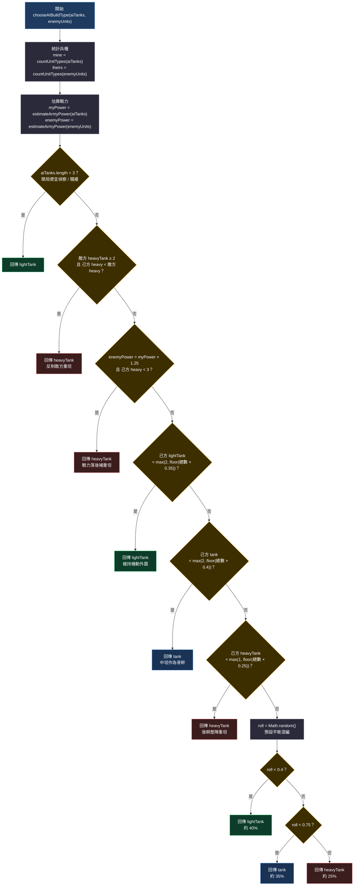

# RTS AI 擴充指南（繁體中文）

本文件說明目前進階版 RTS Demo 的 AI 架構，以及如何一步步把它擴成更完整、更像傳統 RTS 的對手。

主要程式檔：

- [`index.html`](./index.html)

---

## 1. 目前 AI 在做什麼

目前 AI 已經不是「亂衝最近敵人」的骨架，而是一顆有狀態的 RTS 大腦。

### 1.1 核心狀態 `aiState`

```js
const aiState = {
  initialized: false,
  phase: 'bootstrap', // bootstrap | build | defend | attack
  baseDir: null,
  homePos: null,
  maxFactories: 2,
  maxArmy: 16,
  attackGroupMin: 4,
  defendRadius: 4.0,
  threatRadius: 5.4,
  rebuildCooldown: 0,
  waveCooldown: 0,
  waveTimer: 0,
  unitSerial: 0,
};
```

| 欄位 | 意義 |
| --- | --- |
| `phase` | 目前戰略階段：建軍 / 防守 / 進攻 |
| `homePos` / `baseDir` | AI 基地位置與方向 |
| `maxFactories` | 最多蓋幾座工廠 |
| `maxArmy` | 軍隊人數上限 |
| `attackGroupMin` | 至少幾台車才允許出波 |
| `defendRadius` | 基地防守圈 |
| `threatRadius` | 判定「基地受威脅」的範圍 |
| `waveTimer` | 這波進攻還要持續多久 |
| `waveCooldown` | 下一波進攻前的冷卻 |

### 1.2 主迴圈

每幀 `render()` 會呼叫 `updateAI(delta)`。

`updateAI` 大約每 `0.7` 秒思考一次，流程是：

1. 初始化基地（若尚未建立）
2. 重建被摧毀的工廠
3. 條件允許時擴建第二座工廠
4. 管理生產佇列
5. 依敵情切換 `build / defend / attack`
6. 對每台坦克下達移動與攻擊目標

### 1.3 現有能力清單

- 遠側開局：工廠 + 2 台輕坦
- 兵種組成：輕 / 中 / 重坦比例控制
- 落後時加速補兵
- 基地受壓時全軍回防
- 兵力足夠時定時出波
- 攻擊時保留部分守軍
- 集火工廠、殘血、高價值目標
- 接近時保持射擊距離，避免全疊在一起
- 低血量撤退
- 全滅後顯示勝敗畫面

---

## 2. 重要函式地圖

擴 AI 時，優先改這些函式，不要到處散寫邏輯。

| 函式 | 職責 | 建議擴充方向 |
| --- | --- | --- |
| `initAIBase()` | 開局佈署 | 多開局點、假基地、前哨 |
| `chooseAIBuildType()` | 決定下一台產什麼 | 反制表、科技樹、經濟節奏 |
| `manageAIProduction()` | 工廠佇列管理 | 多工廠分工、緊急插單 |
| `maybeExpandAIBase()` | 擴建工廠 | 前推基地、資源點佔領 |
| `maybeRebuildAIFactory()` | 工廠全滅後重建 | 備援基地、重建優先級 |
| `scoreEnemyTarget()` | 目標評分 | 威脅預測、技能單位、建築優先 |
| `pickEnemyTarget()` | 選攻擊目標 | 小隊共用目標、集火上限 |
| `getApproachPoint()` | 接近點 / 風箏點 | 包抄、側翼、包圍 |
| `getDefendPoint()` | 防守站位 | 城牆線、峽谷卡位 |
| `updateAIUnitOrders()` | 單位角色與命令 | 偵察、騷擾、伏擊、撤退重整 |
| `updateAI()` | 總調度 | 難度、個性、多階段戰略 |
| `estimateArmyPower()` | 戰力估算 | 地形、射程、血量曲線 |

### 2.1 `chooseAIBuildType()` 流程圖

此函式由 `manageAIProduction()` 呼叫，決定工廠下一台要排什麼兵。  
輸入：`aiTanks`（己方坦克）、`enemyUnits`（敵方單位）。  
輸出：`'lightTank' | 'tank' | 'heavyTank'`。



**決策優先序（由上到下，先命中先回傳）：**

| 順序 | 條件 | 產出 | 意圖 |
| --- | --- | --- | --- |
| 1 | 坦克總數 &lt; 3 | 輕坦 | 開局快速成形 |
| 2 | 敵重坦 ≥ 2 且己方重坦較少 | 重坦 | 硬碰硬反制 |
| 3 | 敵戰力 &gt; 己方 × 1.25 且己方重坦 &lt; 3 | 重坦 | 落後時拉高質量 |
| 4 | 輕坦比例不足（目標約 35%，至少 2） | 輕坦 | 機動屏 / 騷擾 |
| 5 | 中坦比例不足（目標約 40%，至少 2） | 中坦 | 主力骨幹 |
| 6 | 重坦比例不足（目標約 25%，至少 1） | 重坦 | 後期壓制 |
| 7 | 以上皆滿足 | 隨機 40% / 35% / 25% | 避免組成僵死 |

**擴充時建議插入點：**

- 在步驟 1 之後：依 `aiState.personality` 改開局兵種
- 在步驟 2–3：加入「反制表」（見 §4.7）
- 在步驟 7：依難度調整隨機權重，而不是固定 40/35/25

### 2.2 `updateAIUnitOrders()` 流程圖

此函式由 `updateAI()` 在每次思考 tick 呼叫，負責：

1. 依敵情切換 `build / defend / attack`
2. 把軍隊拆成守軍 / 攻軍
3. 為每台坦克指定 `aiRole`、攻擊目標、移動點

輸入：`aiTanks`、`aiFactories`、`enemies`。  
副作用：改寫 `aiState.phase` / `waveTimer` / `waveCooldown`，以及各單位的 `aiRole`、`attackTarget`、移動命令。

```mermaid
flowchart TD
  A["開始 updateAIUnitOrders(aiTanks, aiFactories, enemies)"] --> B{"aiTanks.length === 0？"}
  B -->|是| Z["直接 return"]
  B -->|否| C["homePos = aiState.homePos<br/>或第一座工廠位置"]
  C --> D["threatsNearBase =<br/>距離 homePos &lt; threatRadius 的敵人"]
  D --> E["myPower / enemyPower<br/>estimateArmyPower"]
  E --> F["計算 canStartAttack<br/>人數≥attackGroupMin<br/>戰力達標<br/>waveCooldown≤0<br/>有敵人"]
  F --> G["計算 keepAttacking<br/>已在 attack<br/>waveTimer&gt;0<br/>人數≥2 且戰力未崩"]

  G --> H{"threatsNearBase.length &gt; 0？"}
  H -->|是| P1["phase = defend<br/>waveTimer = 0"]
  H -->|否| I{"canStartAttack？"}
  I -->|是| P2["phase = attack<br/>waveTimer = 14<br/>waveCooldown = 10"]
  I -->|否| J{"keepAttacking？"}
  J -->|是| P3["phase = attack<br/>維持本波"]
  J -->|否| P4["phase = build<br/>waveTimer = 0"]

  P1 --> K
  P2 --> K
  P3 --> K
  P4 --> K

  K["建立 focusCounts<br/>統計目前已鎖定各目標的單位數"] --> L{"依 phase 算 defendCount"}
  L --> L1["attack → max(1, floor(n×0.25))"]
  L --> L2["defend → 全部 n"]
  L --> L3["build → max(1, ceil(n×0.45))"]
  L1 --> M
  L2 --> M
  L3 --> M

  M["依單車戰力由高到低排序<br/>強車優先當攻軍"] --> N["切分<br/>defenders = 較弱的 defendCount 台<br/>attackers = 其餘"]

  N --> DEF["── 守軍迴圈 defenders ──"]
  DEF --> D0["取 hpPct"]
  D0 --> D1{"hpPct &lt; 0.3 且有 homePos？"}
  D1 -->|是| D2["aiRole = retreat<br/>移到 getDefendPoint<br/>仍可 pickEnemyTarget 還擊"]
  D1 -->|否| D3["aiRole = defend"]
  D3 --> D4["localEnemies =<br/>基地威脅 或 defendRadius×1.5 內敵人"]
  D4 --> D5{"attackTarget 仍有效？"}
  D5 -->|否| D6["pickEnemyTarget(...)<br/>更新 focusCounts"]
  D5 -->|是| D7
  D6 --> D7{"目標距離 &lt; defendRadius×1.2？"}
  D7 -->|是| D8["getApproachPoint 接戰<br/>standoff = fireRange×0.7"]
  D7 -->|否| D9["有 homePos → getDefendPoint 站位"]
  D2 --> DNEXT["下一台守軍"]
  D8 --> DNEXT
  D9 --> DNEXT
  DNEXT --> DEFEND_DONE{"守軍處理完？"}
  DEFEND_DONE -->|否| D0
  DEFEND_DONE -->|是| ATK

  ATK["── 攻軍迴圈 attackers ──"] --> A0["取 hpPct"]
  A0 --> A1{"hpPct &lt; 0.28 且有 homePos？"}
  A1 -->|是| A2["aiRole = retreat<br/>撤回 getDefendPoint<br/>continue"]
  A1 -->|否| A3["aiRole = attack"]
  A3 --> A4{"目標無效<br/>或 random &lt; 0.08 重新鎖定？"}
  A4 -->|是| A5["調整 focusCounts<br/>pickEnemyTarget 全圖敵人"]
  A4 -->|否| A6
  A5 --> A6{"有 target？"}
  A6 -->|否| A7["有 homePos → 回防點待命"]
  A6 -->|是| A8["dist vs fireRange"]
  A8 --> A9{"dist &gt; range×0.85？"}
  A9 -->|是| A10["接近：approach range×0.65"]
  A9 -->|否| A11{"dist &lt; range×0.35？"}
  A11 -->|是| A12["風箏外拉：approach range×0.7"]
  A11 -->|否| A13{"沒有 moveTarget？"}
  A13 -->|是| A14["佔射擊位：approach range×0.6"]
  A13 -->|否| A15["維持現有移動 / 射擊"]

  A2 --> ANEXT["下一台攻軍"]
  A7 --> ANEXT
  A10 --> ANEXT
  A12 --> ANEXT
  A14 --> ANEXT
  A15 --> ANEXT
  ANEXT --> ATTACK_DONE{"攻軍處理完？"}
  ATTACK_DONE -->|否| A0
  ATTACK_DONE -->|是| END["結束（本 tick 命令已下達）"]

  classDef start fill:#1e3a5f,stroke:#7eb6ff,color:#fff
  classDef decision fill:#3d2e00,stroke:#f0c040,color:#fff
  classDef phase fill:#4a1f6b,stroke:#c084fc,color:#fff
  classDef defend fill:#0d3d2a,stroke:#4ade80,color:#fff
  classDef attack fill:#3b1d1d,stroke:#f87171,color:#fff
  classDef calc fill:#2a2a3a,stroke:#a0a0b0,color:#fff
  classDef endnode fill:#1e3a5f,stroke:#7eb6ff,color:#fff

  class A,Z,END start
  class B,H,I,J,D1,D5,D7,A1,A4,A6,A9,A11,A13,DEFEND_DONE,ATTACK_DONE decision
  class P1,P2,P3,P4,L,L1,L2,L3 phase
  class DEF,D2,D3,D4,D6,D8,D9,DNEXT defend
  class ATK,A2,A3,A5,A7,A10,A12,A14,A15,ANEXT attack
  class C,D,E,F,G,K,M,N,D0,A0,A8 calc
```



**整體可看成三階段：**

```text
① 戰略切相  →  phase = defend | attack | build
② 編隊切分  →  defenders / attackers + focusCounts
③ 單位微操  →  role / target / move（守軍與攻軍各一套）
```

#### 階段切換優先序

| 優先 | 條件 | phase | 附帶效果 |
| --- | --- | --- | --- |
| 1 | 基地 `threatRadius` 內有敵人 | `defend` | 清掉 `waveTimer`，全軍傾向回防 |
| 2 | `canStartAttack` | `attack` | 新波：`waveTimer=14`、`waveCooldown=10` |
| 3 | `keepAttacking`（波次未結束且未崩盤） | `attack` | 維持進攻 |
| 4 | 其他 | `build` | 屯兵、清 `waveTimer` |

`canStartAttack` 細節：

- `aiTanks.length >= attackGroupMin`（預設 4）
- `myPower >= min(enemyPower × 0.75, enemyPower + 1.5)`
- `waveCooldown <= 0`
- `enemies.length > 0`

#### 守軍 / 攻軍比例

| phase | defendCount | 含義 |
| --- | --- | --- |
| `attack` | `max(1, floor(n × 0.25))` | 約 25% 留守 |
| `defend` | 全部 | 全軍護廠 |
| `build` | `max(1, ceil(n × 0.45))` | 約 45% 護廠，其餘可待命 |

排序規則：單車戰力**高 → 低**；較弱的那一段當守軍，較強的當攻軍（進攻時強車先上）。

#### 單位行為摘要

| 角色 | 觸發 | 移動 | 攻擊目標 |
| --- | --- | --- | --- |
| `retreat`（守軍） | HP &lt; 30% | `getDefendPoint` 後撤 | 仍可對附近敵還擊 |
| `defend` | 編入守軍且血量尚可 | 近敵則 approach；否則站防圈 | 優先基地威脅 / 防圈敵人 |
| `retreat`（攻軍） | HP &lt; 28% | 直接撤回 home 防點 | 本 tick 不追擊 |
| `attack` | 編入攻軍且血量尚可 | 依距離接近 / 風箏 / 佔位 | 全圖 `pickEnemyTarget`，約 8% 機率換火 |

攻軍距離邏輯（`range = fireRange`）：

| 距離 | 動作 |
| --- | --- |
| `dist > range × 0.85` | 接近到 `range × 0.65` |
| `dist < range × 0.35` | 外拉風箏到 `range × 0.7` |
| 中距且無 `moveTarget` | 佔射擊位 `range × 0.6` |
| 中距且已在移動 | 維持，避免每 tick 重路徑 |

#### 相依函式

| 函式 | 在本流程中的用途 |
| --- | --- |
| `estimateArmyPower` | 戰力、排序、出波門檻 |
| `pickEnemyTarget` / `scoreEnemyTarget` | 選集火目標 |
| `getDefendPoint` | 防圈站位 / 撤退點 |
| `getApproachPoint` | 接戰、風箏、射擊位 |
| `issueAIMove` | 靜音下達移動（內部 `needsRepath`） |
| `isValidTarget` | 目標是否仍存活且在敵方清單 |

#### 擴充時建議插入點

- **階段切換之後**：加入 `regroup` / `pressure` / `allin`（見 §4.8、§6）
- **defendCount 計算**：依 `personality` 改留守比例（烏龜多留、狂戰士少留）
- **切分 defenders/attackers 之後**：再拆 `raid` 小隊打暴露工廠（見 §4.5、§5.2）
- **攻軍選目標前**：改讀 `aiMemory` 而非全知 `enemies`（見 §4.3）
- **風箏 / 接近**：改 `getApproachPoint` 做側翼包抄（見 §4.4）

---

## 3. 建議的分層架構

若要長期擴充，建議把 AI 想成四層：

```text
戰略層 Strategy
  └─ 我現在該經濟、防守、還是總攻？

戰役層 Operations
  └─ 這波要打哪、留多少人、從哪條路過去？

戰術層 Tactics
  └─ 這台車該集火誰、站哪、要不要撤？

微操層 Micro
  └─ 移動、射擊距離、風箏、避免重疊
```

目前程式大致對應：

- 戰略：`aiState.phase` + `updateAIUnitOrders` 前半
- 戰役：出波條件、防守比例、工廠擴建
- 戰術：`scoreEnemyTarget` / `pickEnemyTarget`
- 微操：`getApproachPoint` / `issueAIMove`

擴充時盡量維持這個分層，避免所有 if-else 都塞進 `updateAI`。

---

## 4. 優先擴充項目（由易到難）

### 4.1 難度檔位（最容易，立刻有效）

新增：

```js
const AI_DIFFICULTY = {
  easy: {
    thinkInterval: 1.1,
    maxFactories: 1,
    maxArmy: 10,
    attackGroupMin: 6,
    productionAggressiveness: 0.7,
    aimError: 0.15,
  },
  normal: {
    thinkInterval: 0.7,
    maxFactories: 2,
    maxArmy: 16,
    attackGroupMin: 4,
    productionAggressiveness: 1.0,
    aimError: 0.05,
  },
  hard: {
    thinkInterval: 0.45,
    maxFactories: 3,
    maxArmy: 24,
    attackGroupMin: 3,
    productionAggressiveness: 1.25,
    aimError: 0.0,
  },
};
```

套用方式：

1. 開局選難度
2. 把對應數值寫進 `aiState`
3. 簡單模式可故意延遲發現玩家、降低集火精度

### 4.2 AI 個性 / 流派

不要只有一種 AI。可做：

| 個性 | 行為 |
| --- | --- |
| 烏龜型 | 多防守、晚出波、重坦比例高 |
| 狂戰士 | 早攻、輕坦海、少留家 |
| 技術型 | 優先反制玩家兵種 |
| 經濟型 | 先雙工廠，再一次大軍壓上 |
| 騷擾型 | 輕坦繞後打工廠，主力另路推進 |

實作建議：

```js
aiState.personality = 'raider'; // turtle | berserker | tech | eco | raider
```

然後在：

- `chooseAIBuildType()`
- `canStartAttack`
- `defendCount`

三處依個性調整權重。

### 4.3 偵察與地圖資訊

現在 AI 幾乎是「全知」：直接讀 `getTeamUnits(PLAYER_TEAM)`。

更像傳統 RTS 的做法：

1. 新增 `aiMemory`
2. 只有進入視野的敵人才更新
3. 失去視野後保留「最後已知位置」一段時間

```js
const aiMemory = {
  lastSeen: new Map(), // unitId -> { pos, type, time, hp }
  knownEnemyBase: null,
  scoutingDue: true,
};
```

擴充單位角色：

- `scout`：繞行星巡邏
- `attack`
- `defend`
- `raid`
- `retreat`

沒看到敵人時，不要傻站，應派 scout 繞行。

### 4.4 多路進攻與包抄

目前攻擊大致是「朝目標接近」。

可改成：

1. 把攻擊部隊拆成 A/B 兩隊
2. A 隊正面吸引
3. B 隊沿球面側翼繞到工廠後方

球面側翼可用：

- 目標方向 `targetDir`
- 切線方向 `side`
- 再偏移一個角度當第二路

這會立刻讓 AI 看起來聰明很多。

### 4.5 騷擾與斬首

傳統 RTS 很吃「打經濟」。

新增規則：

- 若玩家工廠暴露且防守薄弱，派 2–3 台輕坦 `raid`
- 目標優先：`tankFactory` > 殘血重坦 > 落單單位
- 成功打掉工廠後，暫時轉 `build` 擴大優勢

可在 `scoreEnemyTarget()` 加強：

```js
if (type === 'tankFactory' && enemyGuardsNearby < 2) score += 120;
```

### 4.6 防守編隊與護廠

現在防守是圍著 `homePos` 站一圈。

可再細分：

- 內圈：重坦護廠
- 外圈：中坦攔截
- 巡邏圈：輕坦掃蕩

當 `threatsNearBase.length > 0`：

1. 全部取消遠征
2. 先集火最靠近工廠的敵人
3. 低血量單位退到工廠後方，不要堵門口

### 4.7 生產大腦升級

`chooseAIBuildType()` 可改成明確反制表：

| 玩家主力 | AI 回應 |
| --- | --- |
| 大量輕坦 | 中坦 + 範圍集火 |
| 大量中坦 | 重坦頂前，輕坦側打 |
| 大量重坦 | 先出輕坦風箏，再補重坦 |
| 多工廠 | 優先斬首工廠 |
| 幾乎沒車 | 快速輕坦壓力 |

也可加入「生產階段」：

1. 開局 0–60 秒：輕坦為主
2. 中期：中坦骨幹
3. 後期：重坦決戰
4. 落後時：便宜單位補數量
5. 領先時：高階單位擴大勝勢

### 4.8 撤退、重整、再出擊

現在低血會退，但整波潰敗後重整還不夠完整。

建議新增：

```js
aiState.rallyPos = null;     // 重整點
aiState.regroupTimer = 0;    // 重整倒數
```

當：

- 戰力突然掉很多
- 或進攻方死亡率過高

就：

1. `phase = 'regroup'`
2. 全軍退到 `homePos` 外圍
3. 補兵到門檻
4. 再轉 `attack`

這比「死一個補一個繼續送」更像真人。

### 4.9 地形與球面戰術

這是行星戰場，不該當平面 RTS。

可擴充：

- 高地優勢：高海拔站位加分
- 峽谷卡位：窄地形用重坦堵
- 繞球最短路徑：大圓航線
- 對腳攻擊：從行星另一側偷家

`getApproachPoint()` 很適合承接這些邏輯。

### 4.10 多 AI 或同盟

若之後要 1v1v1 或 2v2：

- 每個 AI 一份 `aiState`
- `updateAIForTeam(team, state, delta)`
- 目標選擇排除同盟
- 可做簡單協同：一起集火同一高價值目標

---

## 5. 建議新增的資料結構

### 5.1 單位 AI 資料

```js
unit.userData.ai = {
  id: 1,
  role: 'defend',      // scout | defend | attack | raid | retreat
  squadId: 'main',
  attackTarget: null,
  guardTarget: null,   // 護哪個建築
  goalPos: null,
  lastCommandAt: 0,
  stickiness: 0,       // 目標黏著，避免一直換火
};
```

### 5.2 小隊

```js
aiState.squads = {
  main: { role: 'attack', unitIds: [], target: null },
  home: { role: 'defend', unitIds: [], target: null },
  raid: { role: 'raid', unitIds: [], target: null },
};
```

好處：

- 不再每台車各想各的
- 容易做「主攻 + 偷家」
- 方便 UI debug：畫出每隊目標

### 5.3 威脅與機會黑板（Blackboard）

```js
aiState.board = {
  enemyPower: 0,
  myPower: 0,
  baseThreat: 0,
  exposedEnemyFactory: null,
  bestAttackTarget: null,
  shouldExpand: false,
  shouldRegroup: false,
};
```

每 tick 先更新 blackboard，再讓各模組讀它。  
這比到處重複算 `estimateArmyPower` 更乾淨。

---

## 6. 階段狀態機建議

把現在的字串 phase 擴成更完整狀態機：

```text
bootstrap
  → open
  → build
  → pressure      // 小股試探
  → attack
  → defend
  → regroup
  → allin         // 殘局梭哈
  → defeated
```

轉移條件示例：

| 從 | 到 | 條件 |
| --- | --- | --- |
| `build` | `pressure` | 有 3+ 輕坦且已知敵廠 |
| `build` | `attack` | 戰力達標且冷卻結束 |
| `attack` | `defend` | 基地進入 `threatRadius` |
| `attack` | `regroup` | 本波損失 > 40% |
| `defend` | `build` | 威脅清除且工廠還在 |
| `regroup` | `attack` | 補兵完成 |
| any | `allin` | 己方工廠全毀但還有軍隊 |

---

## 7. 實作路線圖

### 第 1 步：可調參

- 難度
- 最大軍隊
- 出波間隔
- 防守比例

先不要加複雜行為，先讓手感可調。

### 第 2 步：角色系統

給每台 AI 單位明確 `aiRole`：

- defend
- attack
- retreat

並在畫面暫時用顏色或 label debug。

### 第 3 步：小隊

拆成 home / main 兩隊。  
能穩定「一半守家、一半出擊」後，再加 raid 隊。

### 第 4 步：記憶與偵察

拿掉全知視野，AI 會開始像玩家一樣「先找再打」。

### 第 5 步：反制與個性

同一套系統，用權重做出不同對手風格。

### 第 6 步：高階戰術

- 雙路包抄
- 假進攻真偷家
- 誘敵離廠再斬首
- 殘局 all-in

---

## 8. 可直接動手的程式改造點

### 8.1 在 `aiState` 加擴充欄位

```js
const aiState = {
  // ...既有欄位
  difficulty: 'normal',
  personality: 'balanced',
  squads: {
    home: [],
    main: [],
    raid: [],
  },
  memory: {
    enemyBasePos: null,
    lastCombatAt: 0,
  },
  board: {
    myPower: 0,
    enemyPower: 0,
    baseThreat: 0,
  },
};
```

### 8.2 把出波條件獨立成函式

```js
function shouldAIAttack(aiTanks, enemies) {
  const myPower = estimateArmyPower(aiTanks);
  const enemyPower = estimateArmyPower(enemies);
  return (
    aiTanks.length >= aiState.attackGroupMin &&
    myPower >= enemyPower * 0.75 &&
    aiState.waveCooldown <= 0 &&
    enemies.length > 0
  );
}
```

之後要加個性、難度，只改這一個函式。

### 8.3 把防守比例獨立成函式

```js
function getDesiredDefendCount(total, phase) {
  if (phase === 'defend') return total;
  if (phase === 'attack') return Math.max(1, Math.floor(total * 0.25));
  return Math.max(1, Math.ceil(total * 0.45));
}
```

### 8.4 Debug 面板

強烈建議加一個簡單 overlay：

- 目前 phase
- 我方/敵方戰力
- 工廠數
- 軍隊數
- 下一波冷卻
- 各角色人數

沒有 debug，AI 很難調。

---

## 9. 平衡與手感原則

擴 AI 時避免這些常見錯誤：

1. **全知且瞬時反應**  
   玩家會覺得作弊，不覺得強。

2. **只會堆數量**  
   看起來笨，輸了也不服氣。

3. **所有單位同一目標**  
   容易擠成一團，路徑互相卡住。

4. **永不撤退**  
   送兵會讓 AI 越打越窮。

5. **參數寫死在很多地方**  
   之後調難度會改到崩潰。

較好的手感是：

- 明顯比玩家勤奮
- 但會犯錯
- 會被騙離基地
- 會因為偵察不足打錯點
- 一旦成形又能狠狠懲罰玩家

---

## 10. 測試清單

每次改 AI，至少測這些情境：

1. **開局 30 秒**  
   AI 有沒有正常產兵，而不是發呆。

2. **玩家爆衝 AI 基地**  
   能否及時回防，而不是繼續外出。

3. **玩家只龜家**  
   AI 會不會組波來打，而不是永遠對峙。

4. **打掉 AI 工廠**  
   會不會重建，重建期間會不會亂送。

5. **AI 領先很多**  
   會不會結束比賽，而不是無意義繞圈。

6. **AI 殘血部隊**  
   會不會撤退，而不是站著送死。

7. **球面另一側作戰**  
   路徑與攻擊目標是否仍然合理。

8. **勝敗結算**  
   任一方全滅後是否正確顯示 Victory / Defeat。

---

## 11. 進階方向（可選）

若之後還要更強，可考慮：

### 11.1 Utility AI

每個行動算分：

- 擴建工廠
- 出波
- 防守
- 偷家
- 重整

誰分高做誰。比硬寫 if-else 更彈性。

### 11.2 GOAP / 行為樹

適合複雜目標，例如：

- 目標：摧毀玩家工廠
- 條件：需要 6 台車、需要知道位置、需要護廠部隊

### 11.3 學習式調參

先不必上機器學習。  
只要記錄：

- 哪種開局勝率高
- 何時出波勝率高

用簡單統計調權重，就已經很強。

---

## 12. 最小可行擴充（建議下一版就做）

若只想先做一版「明顯更強、但改動可控」的 AI，建議只做這 5 件事：

1. **難度三檔**
2. **home / main 兩小隊**
3. **工廠優先斬首**
4. **潰敗後 regroup**
5. **AI debug 面板**

這五項不需要新兵種、不需要新資源系統，但體感會差很多。

---

## 13. 與現有系統的接點

擴 AI 時請重用，不要重寫：

| 現有系統 | 用法 |
| --- | --- |
| `commandMoveTo(point, unit, { silent: true })` | AI 靜音下達移動 |
| `produceTankFromFactory()` | 工廠實際出兵 |
| `getTerrainRadius(dir)` | 球面地表定位 |
| `wouldOverlap()` | 避免重疊 |
| `damageUnit()` / `destroyUnit()` | 傷害與陣亡 |
| `checkGameOver()` | 勝負判定 |
| `unit.userData.attackTarget` | 坦克射擊目標 |

注意：

- AI 移動一定要 `silent: true`，否則移動音效會洗頻
- 單位死亡後要清掉其他人的 `attackTarget`
- 遊戲結束後 `updateAI` 必須立刻停止

---

## 14. 結語

現在的 AI 已經具備：

- 基地
- 生產
- 防守
- 出波
- 集火
- 撤退

下一步不該再只是「更會追人」，而應該往傳統 RTS 對手的方向走：

> **有情報、有編隊、有節奏、會偷家、會回防、會重整。**

建議實作順序：

```text
可調參 → 小隊 → 偵察記憶 → 個性流派 → 包抄/偷家 → debug 與平衡
```

如果你要繼續實作，最推薦下一刀直接做：

1. `home/main` 小隊拆分  
2. `regroup` 狀態  
3. 畫面上的 AI debug 狀態列

這三個完成後，再加個性與難度會非常順。
